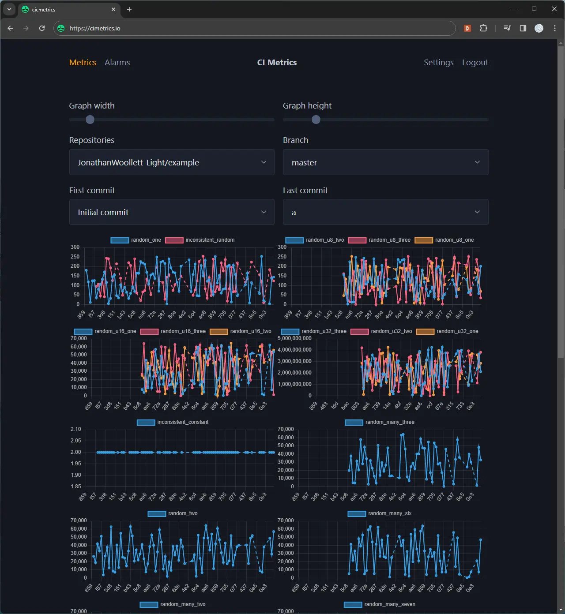

# cimetrics-hello-world

**This is a volatile experiment, you shouldn't use this, instead use https://github.com/bencherdev/bencher.**

A repo presenting an example system for tracking generic metrics in CI like [codecov](https://about.codecov.io).

This is from https://github.com/JonathanWoollett-Light/example/pull/1.

This is from https://cimetrics.io/.

## Account setup

1. Go to https://cimetrics.io/
2. Click "Generate login"
3. Store the filled out public key and private key in a password manager.
4. Click "Login"

## Repository setup

1. Copy [pull_request.yml](./.github/workflows/pull_request.yml) and [push.yml](./.github/workflows/push.yml) to your repo.
2. Update `PUBLIC_KEY` and use repository secrets for `PRIVATE_KEY`.