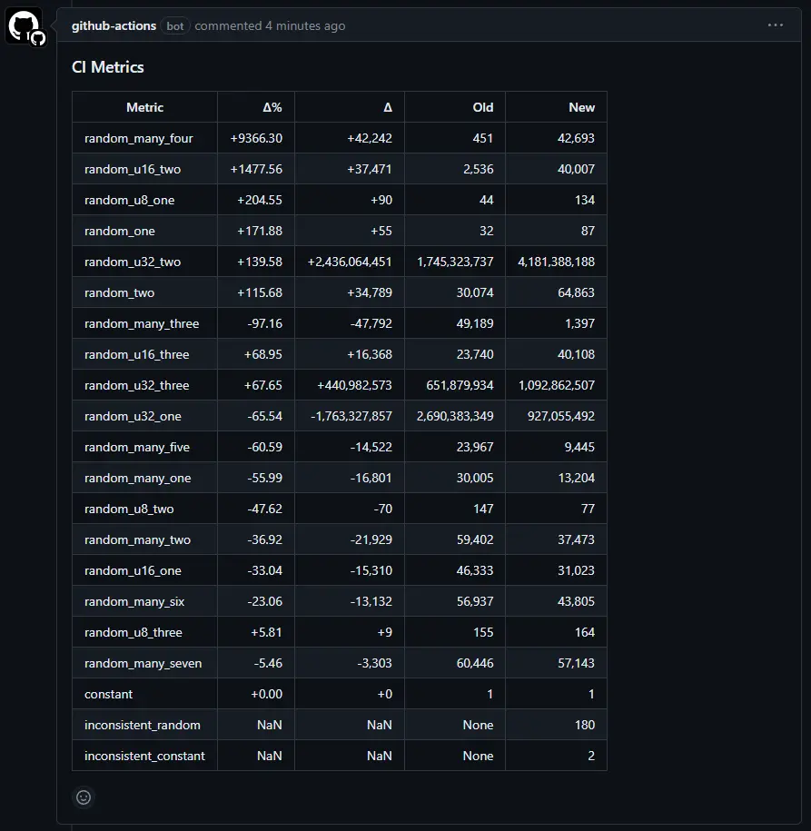
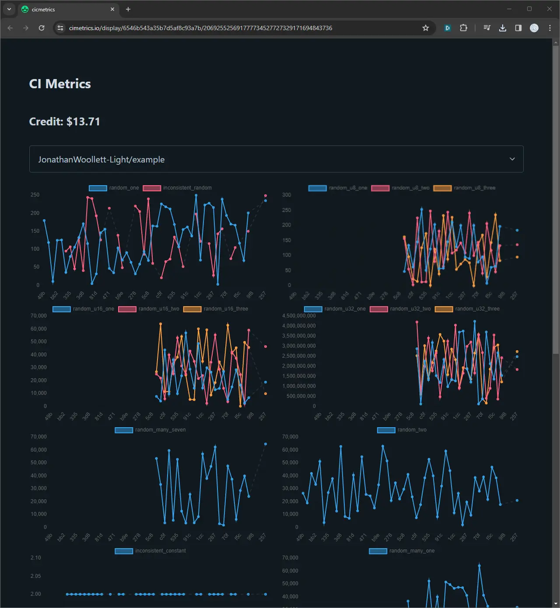

# CI Metrics example

A repo presenting an example project using CI Metrics.

CI Metrics is a system to track metrics like how [codecov](https://about.codecov.io) track code coverage.



This is from https://github.com/JonathanWoollett-Light/cimetrics-hello-world/pull/6#issuecomment-1806123695.



This is from http://3.10.39.149:3000/display/6546b543a35b7d5af8c93a7b/206925525691777734527727329171694843736.

## Setup

1. Create account
   Run `curl -X POST http://3.10.39.149:3000/users`
   Note down the `public_key` and `private_key`.
   There is no recovery mechanism, don't loose these.
2. Copy [pull_request.yml](./.github/workflows/pull_request.yml) and [push.yml](./.github/workflows/push.yml) to your repo.

## Visualize metrics

Visit

```
http://3.10.39.149:3000/display/<your public key>/<your private key>
```

## Display metrics on the same chart

You can display metrics on the same chart.

Set metrics to display on the same chart with:

```bash
curl -X POST http://3.10.39.149:3000/metrics/sets -d "{ \
    \"user\": { \
        \"public_key\": \"<your public key>\", \
        \"private_key\": <your private key> \
    }, \
    \"metric_sets\": [ \
        [\"metric_one\",\"metric_two\"], \
        [\"metric_three\",\"metric_four\"] \
    ] \
}"
```

This sets:

- `metric_one` and `metric_two` to display on the same chart.
- `metric_three` and `metric_four` to display on the same chart.

*Any metric will only ever display on 1 chart.*

Get metrics you display on the same chart with:

```bash
curl -X GET http://3.10.39.149:3000/metrics/sets -d "{ \
    \"public_key\": \"<your public key>\", \
    \"private_key\": <your private key> \
}"
```